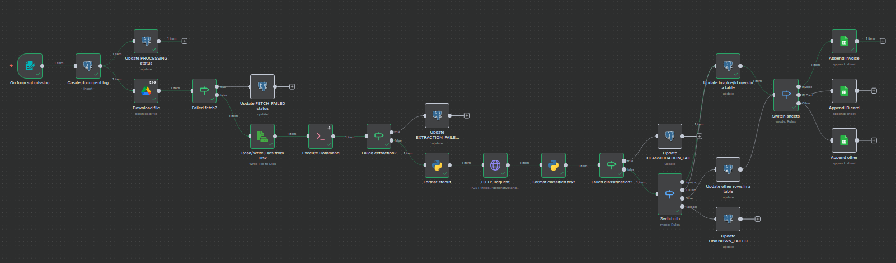

# Cloud Document Triage 🤖📄

An event-driven document triage pipeline orchestrated by n8n, powered by Python data extraction and Gemini-based classification, and backed by PostgreSQL for persistent state tracking.



## Solution Overview

The workflow ingests raw PDFs from Google Drive, authenticates through OAuth 2.0, extracts text with Python/pdfplumber, classifies the document with Gemini 2.0 Flash (e.g., Invoice vs. Identity Document), and persists both the structured payload and lifecycle status in PostgreSQL. A synchronized Google Sheet provides lightweight reporting for business users.

## 🚀 Key Features

- **Hybrid orchestration**: Low-code automation in n8n combined with Python for advanced data extraction and transformation.
- **Intelligent classification**: Gemini 2.0 Flash extracts key metadata (total, vendor, document number) while tagging the document class.
- **Robust state model**: PostgreSQL enum-backed state machine (`PENDING`, `PROCESSING`, `COMPLETED`, `FAILED_FETCH`, `FAILED_EXTRACTION`, `FAILED_CLASSIFICATION`, `NEEDS_REVIEW`).
- **Enterprise-grade error handling**: Dedicated failure paths capture API outages, malformed documents, and low-confidence predictions.
- **Secure authentication**: OAuth 2.0 credentials for Google APIs plus environment-scoped secrets for AI keys.
- **Reproducible environment**: Fully containerized stack with deterministic database initialization scripts.

## 🛠️ Tech Stack

| Layer         | Technology                                     |
| ------------- | ----------------------------------------------- |
| Orchestrator  | n8n (self-hosted, Docker)                       |
| Scripting     | Python 3 + pdfplumber (PDF text extraction)      |
| AI Services   | Google Gemini 2.0 Flash                         |
| Persistence   | PostgreSQL 16 + `uuid-ossp` extension           |
| Cloud APIs    | Google Drive API, Google Sheets API             |
| Infrastructure| Docker & Docker Compose                         |

## 📂 Project Structure

```text
.
├── docker-compose.yml        # Defines n8n and PostgreSQL services
├── Dockerfile                # Custom n8n image with Python/pdfplumber
├── .env                      # Environment variables (not committed)
├── postgres-init/            # Database initialization scripts
│   ├── 01_init.sql           # Schema, tables, enums
│   └── 02_add_error_column.sql
├── python-scripts/           # Custom Python helpers
│   └── process_pdf.py        # PDF ingestion + text extraction
└── workflows/                # n8n workflow definitions
   └── CloudDocumentTriage.json
```

## ⚙️ Setup & Installation

### 1. Prerequisites

- Docker Engine and Docker Compose plugin
- Google Cloud project with Drive API and Sheets API enabled
- Gemini API key (Google AI Studio)

### 2. Google Cloud Configuration

1. Create an OAuth 2.0 Client ID (Web Application) via Google Cloud Console.
2. Set the Authorized redirect URI to `http://localhost:5678/rest/oauth2-credential/callback`.
3. (Testing mode) Add the operators' Google accounts to the OAuth consent screen test user list.

### 3. Environment Configuration

Create a `.env` file in the repository root:

```dotenv
# PostgreSQL
POSTGRES_PASSWORD=mysecretpassword

# AI
GEMINI_API_KEY=replace-with-your-key

# Optional: override defaults such as DB host/port if needed
```

> Never commit the `.env` file. The sample values above must be replaced with project-specific secrets.

### 4. Run the Stack

```bash
docker compose up --build -d
```

- n8n: `http://localhost:5678`
- PostgreSQL: `localhost:5432`

On first startup the `postgres-init` scripts create the schema and enumerations automatically.

### 5. Post-Launch Configuration (n8n UI)

1. Confirm that the **Cloud Document Triage** workflow is loaded (auto-imported from `workflows/`).
2. Configure the Google Drive node with the OAuth Client ID/Secret created earlier.
3. (Optional) Configure the Google Sheets node to point to the reporting spreadsheet.
4. Store the Gemini API key in n8n credentials or rely on the environment variable passed via Docker.

## 🧪 How to Test

1. **Upload a document**: Place a PDF (invoice or ID template) into the monitored Google Drive folder. Prefer PDFs with selectable text for reliable extraction.
2. **Capture the file ID**: From the Drive URL (`https://drive.google.com/file/d/<FILE_ID>/view`) copy the file url.
3. **Trigger the workflow**: In n8n, activate the workflow and open the Form Trigger URL. Submit the file ID.
4. **Verify results**:
   - n8n: Inspect the execution log to ensure the success path ran.
   - PostgreSQL: `SELECT * FROM triage_app.documents_log ORDER BY created_at DESC;`
   - Google Sheets: Confirm a new row with the extracted metadata.

## 🛡️ Error Handling Scenarios

| Condition                | Recorded Status       | Notes |
| ------------------------ | --------------------- | ----- |
| Invalid or missing file  | `FAILED_FETCH`        | Drive API error stored in `error_message` |
| Corrupt / non-PDF asset  | `FAILED_EXTRACTION`   | Python/pdfplumber exception captured |
| Gemini request failure   | `FAILED_CLASSIFICATION` | Includes quota and auth errors |
| Low-confidence prediction| `NEEDS_REVIEW`        | Execution branches to manual review queue |

Review the n8n execution histogram and PostgreSQL log table to investigate failed runs.

## Troubleshooting

- Ensure `GEMINI_API_KEY` is present in your shell or `.env` before running `docker compose`.
- When updating Python dependencies, rebuild the n8n image (`docker compose build n8n`).
- For local development, create a virtual environment (`python3 -m venv .venv`) and install the same Python requirements used in the container.

---

Built with ❤️ by @gbcastilho.
